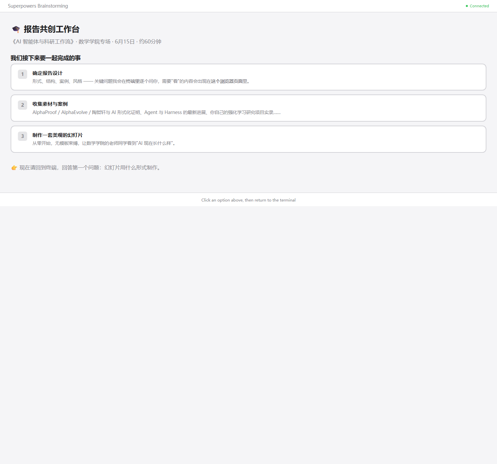
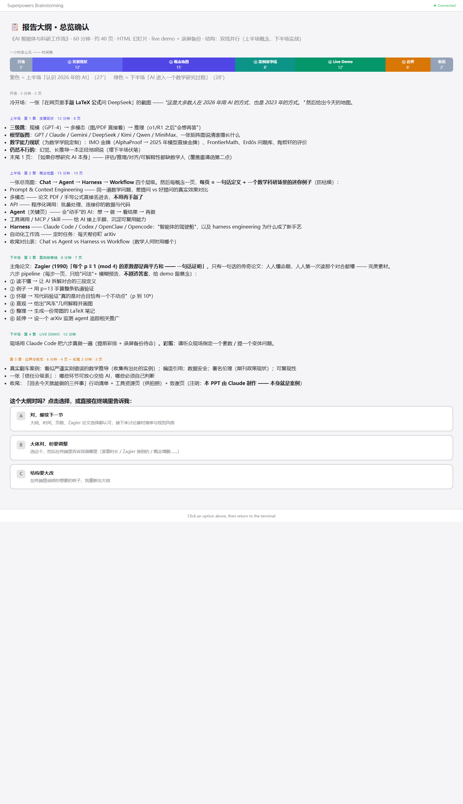
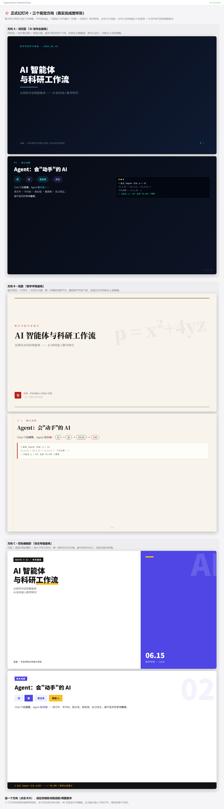
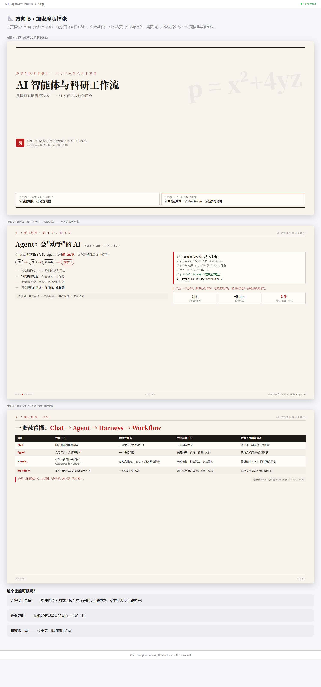
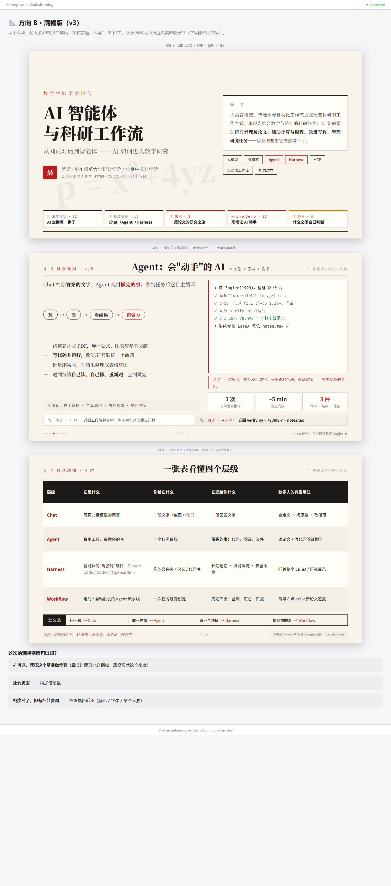
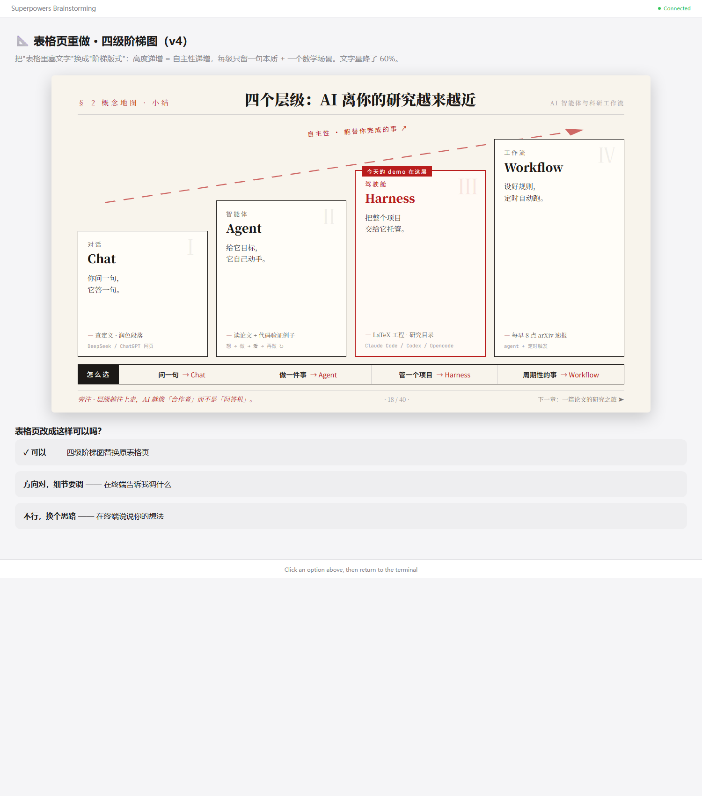

# 《AI 智能体与科研工作流》幻灯片 · 制作实录

> 这份文档记录本次报告幻灯片与 Claude（Fable 5，运行在 Claude Code 中）共创的全过程。
> 它本身就是报告主题的一个真实案例：**人定方向 + AI 动手 + 浏览器里点选反馈 + 终端里讨论迭代**。
> 所有截图由 `_capture.py` 从当时的真实页面渲染存档，可复现。

---

## 0 · 起点（2026-06-11 晚）

**输入**：邀请函、报告摘要、主讲人简介三份材料（`talk/` 目录）。
**需求**：60 分钟，数学学院师生（多数只用过网页对话式 AI），要讲清 AI / Agent / Harness 的区别、科研中的用法与边界，要具体案例，没有 PPT 模板。

**协作方式**：Claude 启动了"视觉伴侣"——一个本地网页（localhost），设计稿实时推送到浏览器，我在浏览器里**点选**，在终端里**讨论**。下图是它推送的第一屏（共创工作台欢迎页）：



---

## 1 · 大纲（提案 → 一次通过）

Claude 先在终端逐个澄清了 4 个问题（幻灯片技术形式 → HTML、live demo → 要且配备用录屏、案例 → 只用纯数学场景、demo 论文 → 它来选经典可验证的），然后提出 3 个结构方案：

- **A 编年史线**：按 AI 发展史推进
- **B 故事驱动线**：一个数学问题的研究之旅为主轴
- **C 双线并行**：上半场概念地图 + 下半场全实战 ← **我选了这个**

确认后它把完整大纲渲染到浏览器：60 分钟时间轴、五章页数预算、案例论文选定 **Zagier (1990) 两平方和一句话证明**：



> 我的反馈："我觉得可以，但是你现在的 html 有点丑，正式 ppt 别也是这样的吧"
> ——由此进入视觉方向讨论。Claude 澄清：脑暴页面是工作草稿，正式幻灯片单独设计。

---

## 2 · 视觉方向三选一

Claude 给出三个方向的"真实完成度样张"（每个方向：封面 + 同一页内容页，便于横向对比）：

| 方向 | 气质 | 我的判断 |
|------|------|----------|
| A 深空蓝 | AI 发布会 | "太 AI 味道了" |
| **B 纸墨** | 数学手稿/精排数学书 | ✅ **选它**（浏览器里点选了 B） |
| C 双色编辑部 | 科技杂志专题 | "不好看" |



> 附加要求："版面排版别像现在这样，太空了" → 进入密度迭代。

---

## 3 · 密度迭代 v2（被打回）

加了双栏、旁注、页眉面包屑、页脚进度，但——

> 我的反馈："你现在每一页只占了一半的版面，密度不够高啊"

问题诊断：内容堆在页面上部，"上重下空"。



---

## 4 · 满幅版 v3（概念页定稿为基准）

排版引擎改为纵向弹性布局：内容从页眉撑到页脚；封面加摘要框 + 关键词条 + 五章目录条；概念页加底部"同一请求 Chat vs Agent"对比条；预览放大到真实放映尺寸。

> 我的反馈："第二页还行，第三页这个表里面放文字不好看"
> → **样张 2（概念页）定为全套 40 页的密度基准**；表格页重做。



---

## 5 · 表格页 → 四级阶梯图 v4

"表里塞文字"改为"版式说话"：四张卡片高度递增 = 自主性递增，沿虚线箭头标注"自主性 · 能替你完成的事 ↗"；每级只留一句本质 + 一个数学场景；Harness 层朱砂高亮并挂牌"今天的 demo 在这层"。文字量比表格版降约 60%。



**状态**：待确认。

---

## 后续待记录

- [ ] 素材与资料收集（fancy 案例、数学能力现状、翻车实例）
- [ ] 全套 40 页初稿
- [ ] live demo 设计与彩排录屏
- [ ] 终稿与 PDF 导出

## 复现截图

```bash
cd "E:/Rist-aware RL/talk/making-of"
python _capture.py          # 只补缺失的
python _capture.py --force  # 全部重截
```
